# nau-discord-bot


This guide is intented to be instructive of how to setup a Discord Bot for the sake of getting the project up and running.

---

# nau-discord-bot Introduction

In essence, this project is a modular, scalable Discord bot intended for use within the Northern Arizona University Computer Science Department. It has general built in commands as well as connection to an LLM, through an engine file to select what base LLM model is wanted.

Each command (and command set) exists in its own file, in its own class to make it modular and easy to find. Shared logic lives in resuable utility modules (services), with the intention of limiting duplicate code.

---

# Table of Contents
This README contains a few sections, namely:
- [1] Features
- [2] Project Structure
- [3] Getting Started
- [4] Setting Up Your Discord Bot in the Developer Portal
- [5] Initialization Completion
- [6] Creating a New Command

Section 1 lists out the core features provided by this project.

Section 2 gives a quick display of the project file structure.

Section 3 defines, step by step, how to begin working with the project. This includes cloneing, setting up requirements, and etc.

Section 4 goes over how to get the bot started in the Discord Developer Portal.

Section 5 gives a quick overview of what can now be done after the completion of section 3 and 4. It also provides a quick warning to the user regarding what may happen if they add new global commands.

Section 6 briefly runs over how to create a new command.

---

## Features
- Modular command system (one file per command and/or command set).
- Auto-loader for commands.
- Shared utility system.
- Clean architectural structure for commands.
- Very beginner friendly and easy to use.
- Ready for production.
- Ready to be expanded.

---

## Project Structure
The project itself is located in the bot folder. That folder is structured such:

bot.py  
requirements.py  
commands/  
    | init.py  
    | {command}.py  
    | constants.py
data/
    | data.txt (as needed)
services/  
    | {utility}.py  


By which the curly brackers {} represent a placeholder for a file and | represents a subfolder.

---

## Getting Started

### 1. Clone the repository

Clone the repository, swap into the repository folder, and create a virtual environment.
```bash
git clone https://github.com/heb229/nau-discord-bot.git
cd nau-discord-bot
python -m venv .venv
```

### 2. Activate virtual environment
Activate the virtual environment. This will depend on the type of machine you have.

Windows:
```bash
.\.venv\Scripts\Activate
```

Unix (Linux or macOS):
```bash
source .venv/bin/activate
```

### 3. Install dependencies
Installs dependencies required for the project to run.

```bash
pip install -r requirements.txt
```

### 4. Configure envrioment variables
Create an .env file in our root directory (the same directory this README.md file is in). In that file, add:

```bash
DISCORD_TOKEN="your_token"
```

where you replace your_token with your actual token. If unsure how to do this, please go to the section tittled: "Setting Up Your Discord Bot in the Developer Portal", in this README file.

Ensure your token is saved as a string (meaning it has quotation marks around it).

### 5. Run the bot

Enter the bot folder:

```bash
cd nau-discord-bot
```

And start the bot with:

```bash
python main.py
```

---

## Setting Up Your Discord Bot in the Developer Portal

Before running your bot locally or deploying it, you need to register it with Discord and get a token.

### 1. Open the Discord Developer Portal

Visit:
[https://discord.com/developers/applications](https://discord.com/developers/applications)


### 2. Create a New Application

1. Click **“New Application”** in the top right.  
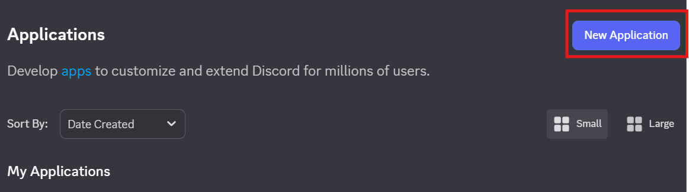 
2. Enter a name for your bot. For example, `nau-discord-bot`.  
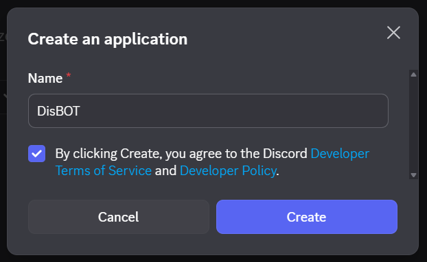
3. Click **Create**.  
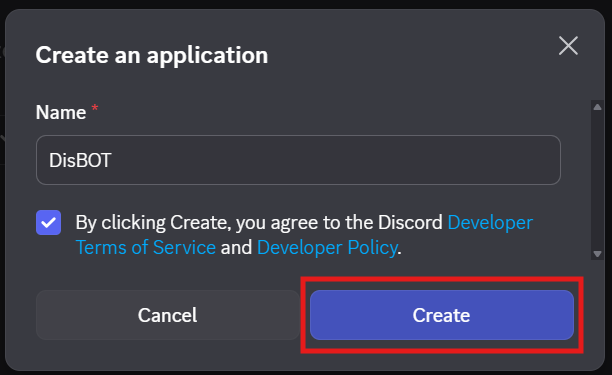


This creates your Discord app, which is essentially the identity of the bot.

### 3. Add a Bot to the Application

1. In the left sidebar, click **“Bot”**.  
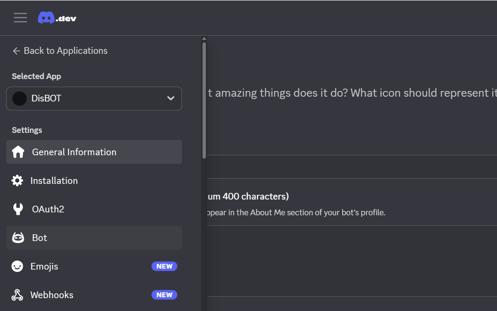

If it doesn't automatically set it up, then do:  
2. Click **“Add Bot”**.  
3. Confirm by clicking **“Yes, do it!”**.  

### 4. Copy Your Bot Token

**Important:** Do not share this publically! This is like a credential; if people have it, then they can take control of your bot.

1. Under the **Bot** tab, scroll down and find "Token".  
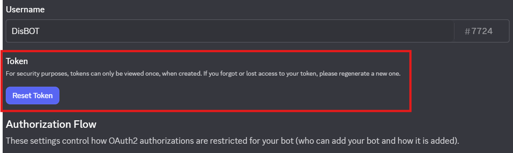

Click **"Reset Token"**. This is also how you reset your token if it ever happens to be leaked.
2. Confirm token reset by clicking **"Yes, do it!"**.  

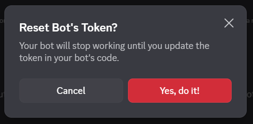  
3. Confirm your Multi-Factor Authentication, if set up.

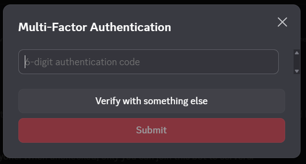

4. Next, copy the token by clicking **"Copy"**  
You will use this token in your .env file. (See step 4 of "Getting Started").
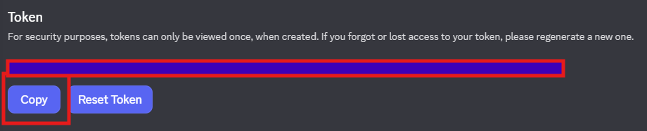

Example:
```bash
DISCORD_TOKEN=your_token
```

5. You will additionally want to grant intent permissions. Still in the **"Bot"** tab, go to the section "**Priveledged Gateway Intents**" and turn them on.  
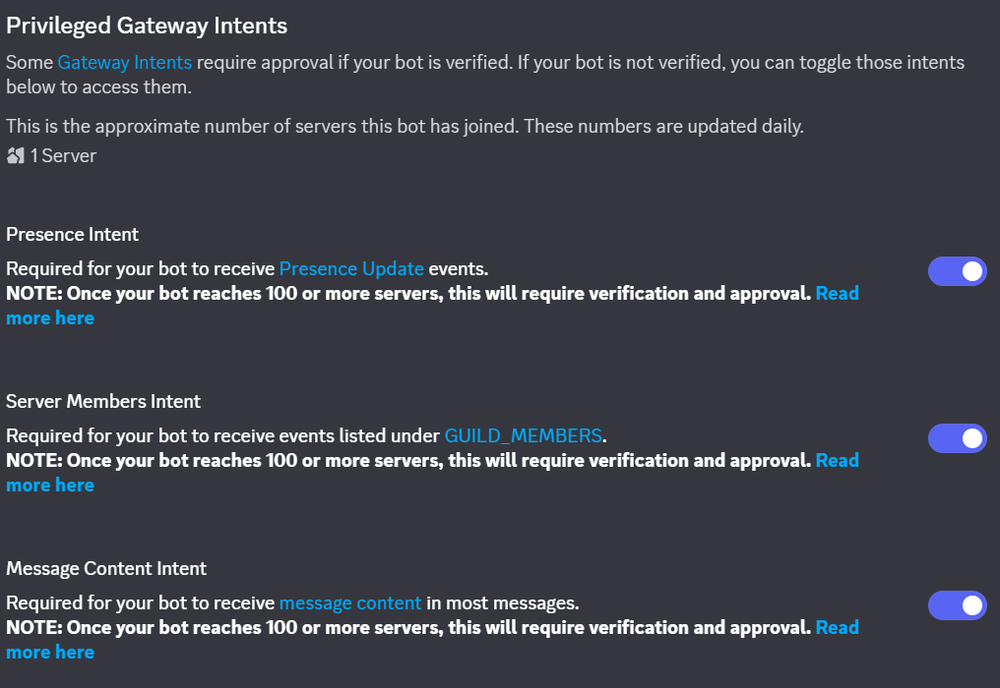

---

### 5. Invite the Bot to Your Server

1. Still in the Developer Portal, go to the **OAuth2** tab.  
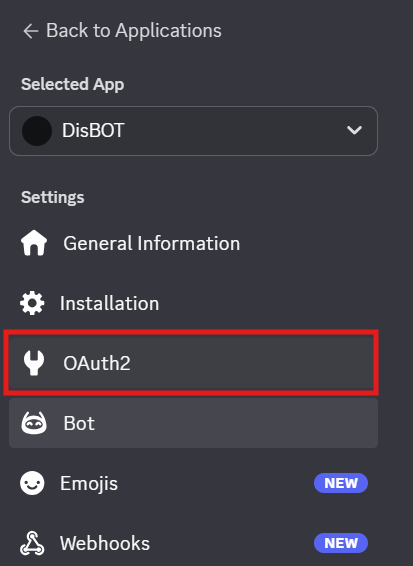
2. Find the section **"OAuth2 URL Generator"** and then under **Scopes**, check:  
- "bot"  
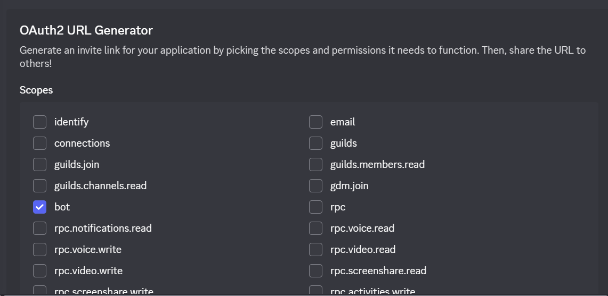


3. Under **Bot Permissions**, select the permissions the bot may need. For example:  

* Send Messages
* Read Message History
* Use Slash Commands
* Potentially even Admin, depending on what you plan to use it for.

4. Copy the generated URL.  
5. Open it in your browser.  
6. Choose the server you want to invite the bot to.  
7. Authorize it.  

Your bot will appear in that server's member list once invited.

---

## Initialization Completion

The bot has now been setup and the inital, pre-built command(s) can run. The bot has also been added to the server you wish to have it on.

Now, you can start using the commands and even make your own. Do keep in mind that new, global commands added to your bot may take up to an hour before they can be run in the server.

---

## Creating a New Command
If you are looking to create a new command, please see these instructions:

1. Create a new file in commands/.  
2. Define the class that should inherit from commands.cog. This is just to keep everything uniform and easy to edit.  
3. Include an async setup() function.  

An example of a new command in it's own file may look like:

```python
# Command file for "example"

# Imports
    # discord
import discord
from discord.ext import commands

# Class to define the example
class Example(commands.Cog):
    # initialize own self
    def __init__(self, bot):
        # set bot
        self.bot = bot

    # define command (example)
    @commands.command()
    async def example(self, ctx):
        # send an example message
        await ctx.send("This is an example!")


# add command to cog
async def setup(bot):
    # set command
    command = Example(bot)

    # add the command to cog
    await bot.add_cog(command)
```

---
**Authors:**
- Haley Berger - heb229 | Last edited: 2/27/26

Please also check out our contributors list for additional people who have contributed to the project.

**Current Status:**
- In Progress
